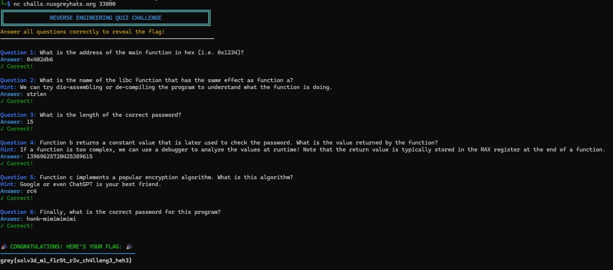
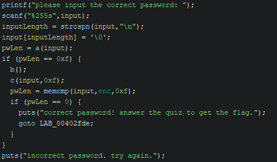

# Information
- **CTF:** *Grey Cat The Flag 2025 Qualifiers*
- **Challenge name:** *Reversing 101*
- **Challenge description:** 
>	*All reverse engineers have to start somewhere. If you have never reverse-engineered before, its time to take your first step!*
>
>	*Use lower case when possible*
- **Category:** *EZPZ*
- **Date:** *June 2025*
# Approach
We are provided with an executable (`chal`) along with an address which we can connect to using netcat.

There are many ways in which we could have gone about solving this, but I chose to use a combination of Ghidra and GDB.

When attempting to run the provided program, it prompts us for a password, while attempting to connect to the server, we are asked questions (note: this screenshot contains the answers to all the questions, I have included it here so that we can see all of the questions).



The answers to these questions can be obtained by reversing the provided program.

The decompiled program is as shown below (obtained from Ghidra):



**Q1**: We can use GDB to very easily obtain the address of the main function as the executable is not stripped.

**Q2**: By simply inspecting the decompiled code in Ghidra, we can figure out that function a simply finds the length of a given string. If we are unfamiliar with libc functions, a simple search should lead us to the `strlen` function.

**Q3**: By inspection of the decompiled code, we can conclude that the length of the password should be 15 characters (as indicated by the equality check of `pwLen` with 0xf, which is 15 in base 10).

**Q4**: We can utilise the emulation feature within Ghidra to obtain the value by emulating function b. The script I used for the emulation was based on [this Github gist](https://gist.github.com/cetfor/18cae544249e4cf78f66930175072876).

**Q5**: We can simply copy-paste the decompiled function c into ChatGPT, and surprisingly we get a response that indicates function c clearly implements the [RC4 algorithm](https://en.wikipedia.org/wiki/RC4).

**Q6**: To obtain the password, we simply have to decrypt the value stored in the `enc` variable within our decompilation! RC4 is a symmetric cipher, meaning that the same key is used for encryption and decryption. It may not be immediately obvious, but function b actually generates the key used in function c for encryption (we can obtain this result by reading the underlying assembly). All we have to do now is to use an online RC4 tool to decrypt the bytes stored in `enc` using our answer to question 4 as the key! Decrypting provides us with the password `honk-mimimimimi`. When we enter the password, we do indeed get the flag!  
# Flag
```grey{solv3d_m1_f1r5t_r3v_ch4lleng3_heh3}```
# Tags
- Grey Cat The Flag 2025
- Rev
- Beginner
---
*Written on 08-06-2025*

