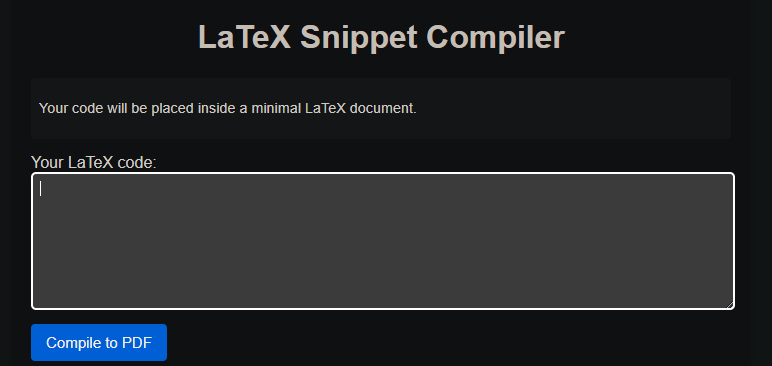

# Information
- **CTF:** *TJCTF*
- **Challenge name:** *TeXploit*
- **Challenge description:** *I made a LaTex compiler that can generate pdfs. It even prints the log file if there is an error. The flag is located in `/flag.txt`.*
- **Category:** *web*
- **Date:** *June 2025*
# Approach
For this challenge, no source files are given. Instead, we are only provided with an instance of the website.


Typing in some valid latex, we can see that it is rendered beautifully in a pdf file.

When I encountered the challenge, I had a hunch that this would be an injection attack, given that although LaTeX is primarily a markup language, it probably could do a lot more. A quick search confirmed my hunch: LaTeX **is** Turing complete (not very relevant info) and **surprise surprise!**, it can read files too (more relevant info)! We've just found an attack vector!

A further search on how to read system files landed me on a [Practical CTF page on LaTeX exploits](https://book.jorianwoltjer.com/languages/latex). Using the following payload, we are indeed able to write the contents of `/etc/passwd` to the pdf.
```latex
\newread\file       % define \file variable
\openin\file=/etc/passwd  % open file into variable
\loop\unless\ifeof\file   % keep reading until EOF
    \read\file to\line    % read to \line variable
    \line       % print \line variable
\repeat
\closein\file
```

Great! So now we just have to replace `/etc/passwd` with `/flag.txt` ... right?

Nope, it doesn't work! In fact, the LaTeX code even fails to compile! This is because LaTeX does not escape the contents in the file, meaning that any special character (`# $ % & ~ _ ^ \ { }`) present in the file can cause the LaTeX compiler to crash if the file contents, after being read, results in the entire snippet of LaTeX code being syntactically wrong.

Our flag definitely contains curly braces, hence it is expected that this method of outputting the flag will not work.

I then proceeded to try many ways to escape the file contents before being displayed, unfortunately, I was unable to do so.

As a last resort, I turned to ChatGPT for help, sharing all of the above information with it. Lo and behold, after some prompting, ChatGPT generated the following payload that did in fact result in the contents of `flag.txt` to be escaped and written to the generated pdf file!
```latex
\newread\myfile
\openin\myfile=/flag.txt
\read\myfile to \mydata
\closein\myfile

\texttt{\expandafter\detokenize\expandafter{\mydata}}
```
# Flag
```tjctf{f1l3_i0_1n_l4t3x?}```
# Tags
- TJCTF
- Web
- Pwn
- Latex
- Code injection
---
*Written on 09-06-2025*

